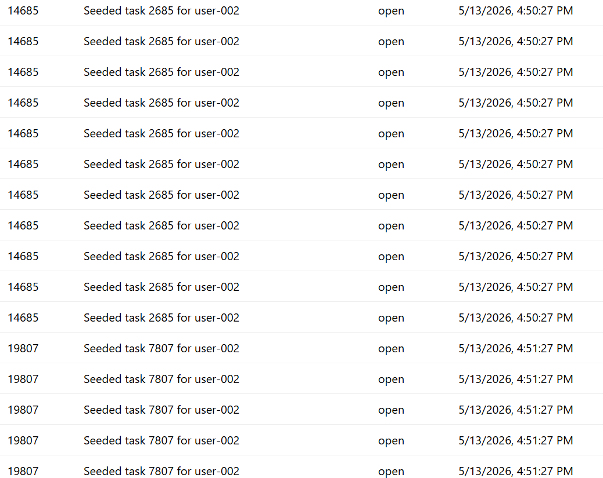
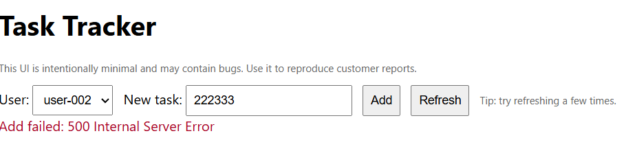

# Debugging Notes

## Issue 1 — Create task 500

The first one I confirmed by looking at the sample_api_log and cross referencing with the RUNBOOK was the create task 500 issue.
`String '' was not recognized as a valid DateTime.`
So I went looking for references to DateTime headers being passed as string format; which led me to the MapPost endpoint.
I had AI write the code fix for this which should handle both customer report 1 and 4. It makes sense why trying again a few seconds later works because the time has changed.

## Issue 2 — Slow list

I read the sample_slow_list log.txt next and knew that would be occurring from the GET request.
I initially just wanted to confirm that the tasks were being loaded asynchronously which led me to the realization that the tasks were all being loaded into memory rather than filtered on the DB side. I had AI write the code fix for this.

## Issue 3 — Duplicates / ordering on refresh

I was able to confirm the duplicates/ordering weakness first because I was able to replicate it easily.
The UI note said `"Tip: try refreshing a few times."` so I pressed it 5 times in a row and noticed that the tasks seemed to be being appended.
This was an easy fix because the `refresh()` was clearly concatenating instead of replacing.

## Quality of life improvements

1. In the table, clarify if the ID is a random UID or task ID. I initially was trying to familiarize myself with the app. I wasn't sure if that was a bug since I'm not sure if "seeded task 932" for example is supposed to be for ID = 932. Updated column labels would help.

2. I think it's fair that a new task should not be numbers only, but instead of a 500 server error it should display a more descriptive error message.
   
